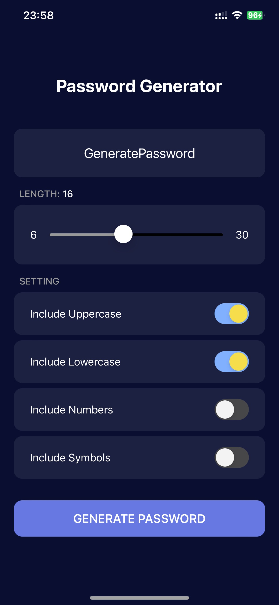

## Tên ứng dụng: Password Generator - Trình Tạo Mật Khẩu

-   Đoàn Hải Duy
-   63130260

**Mô tả:**

Ứng dụng này giúp bạn tạo mật khẩu ngẫu nhiên mạnh mẽ và an toàn cho các tài khoản mạng xã hội, google,..

**Tính năng:**

-   Tạo mật khẩu ngẫu nhiên với độ dài tùy chỉnh
-   Chọn các loại ký tự bao gồm trong mật khẩu (chữ hoa, chữ thường, số, ký hiệu)
-   Sao chép mật khẩu vào clipboard

**Hướng dẫn sử dụng:**

1. Mở ứng dụng.
2. Chọn độ dài mật khẩu mong muốn.
3. Chọn các loại ký tự muốn bao gồm trong mật khẩu.
4. Nhấn nút "Generator Password".
5. Sao chép mật khẩu vào clipboard hoặc lưu trữ trong danh sách an toàn.

**Hình ảnh minh họa:**

**Video minh họa:**

**Công nghệ:**

-   React Native
-   Expo
-   Typescript
